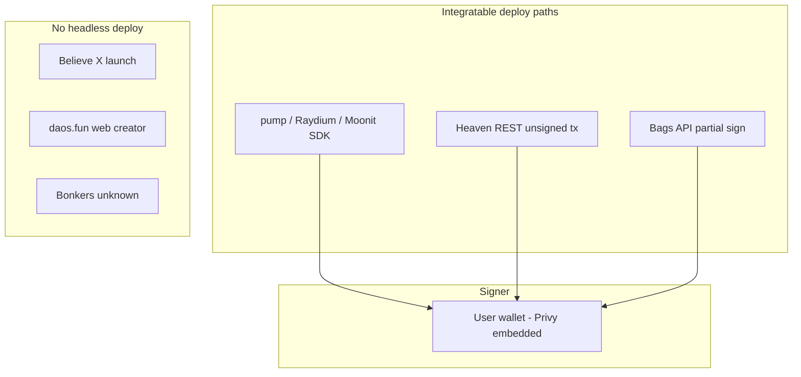

# Launchpad deploy APIs — research

**Status:** Research only (May 2026) — **pending product review**  
**Implementation:** Blocked until this doc and [`multi-wallet-architecture.md`](./multi-wallet-architecture.md) are approved.  
**Audience:** Product + engineering (Pointer deploy / pulse automation)  
**Scope:** Programmatic **token creation** from a third-party app for: pump.fun, Bonk (LetsBonk), Moonshot (Moonit), Bags, Bonkers, Believe, Heaven, daos.fun.

**Auto-launch dependency:** Even “open” launchpads (pump, Bags, Heaven, Moonit) need a **signing wallet** and optional **server-side API keys** (Bags). Wallet architecture must be settled before building deploy executors.

---

## Executive summary

| Platform | Public API / SDK for deploy? | Realistically integrable? | Notes |
|----------|------------------------------|----------------------------|--------|
| **pump.fun** | Yes — on-chain SDK (`@pump-fun/pump-sdk`) | **Yes** | No hosted REST; you build + sign txs locally. |
| **Bonk** (LetsBonk / bonk.fun) | Partial — **Raydium LaunchLab** via `@raydium-io/raydium-sdk-v2` | **Partial** | No official `bonk.fun` REST; same infra as LetsBonk. |
| **Moonshot** | Yes — rebranded to **Moonit** (`@moonit/sdk`) | **Yes** | Legacy `@wen-moon-ser/moonshot-sdk` → migrate to `@moonit/sdk`. |
| **Bags** | Yes — **Bags Public API v2** + `@bagsfm/bags-sdk` | **Yes** | API key + user wallet sign (mint partially pre-signed by Bags). |
| **Bonkers** | **Not found** (no official docs/API) | **Closed / unknown** | Separate Pointer brand; treat as unverified until platform confirms. |
| **Believe** | Flywheel API only — **no deploy API** | **Closed** for deploy | Coins launched via **X / @launchcoin** flow, not third-party mint API. |
| **Heaven** | Yes — **REST tx builder** (`tx.api.heaven.xyz`) | **Yes** | Unsigned txs; user (or your custodial) wallet signs. |
| **daos.fun** | Read-only **GET DAO** API | **Closed** for deploy | Product is **DAO raises**, not a memecoin bonding-curve launcher. |

**Practical takeaway for Pointer:** Prioritize **pump SDK**, **Bags API**, **Heaven REST**, and **Moonit SDK** for true “deploy from our app.” Use **Raydium LaunchLab** for Bonk-ecosystem launches. Treat **Believe**, **daos.fun**, and **Bonkers** as **not deploy-integrable** today (deep-link / manual / indexer-only).

---

## Comparison matrix

| Platform | Official surface | Auth | Who signs deploy tx? | Deploy / platform fees (official) | Time to tradable listing* |
|----------|------------------|------|----------------------|-----------------------------------|---------------------------|
| pump.fun | `@pump-fun/pump-sdk` | None (RPC + program) | **User wallet** (your app builds ix, user signs) | Creation **free**; **0.02 SOL** “first buy” + gas if you buy at create to go on-chain ([Pump help](https://intercom.help/pumpfun-web/en/articles/11002205-create-a-coin-on-pump-fun)) | ~1 confirmation after signed create (+ optional first buy) |
| Bonk | Raydium `LaunchpadModule` in [raydium-sdk-V2](https://github.com/raydium-io/raydium-sdk-V2/tree/master/src/raydium/launchpad) | None (RPC + program) | **User wallet** | LaunchLab deploy **&lt; 0.1 SOL** total cited in Raydium builder docs; LetsBonk UI adds **1% swap fee** on curve trades (platform marketing — confirm on-chain config per pool) | ~1 confirmation after launch tx |
| Moonit | `@moonit/sdk` ([Bot SDK](https://docs.moon.it/docs/bot-sdk)) | None (RPC + program) | **User wallet** | **1%** trade fee on bonding curve ([Moonit FAQ](https://docs.moon.it/docs/welcome)); migration fees **3–6 SOL** at graduation ([curves](https://docs.moon.it/docs/bonding-curves)) | ~1 confirmation after mint; CA suffix `moon` |
| Bags | `https://public-api-v2.bags.fm/api/v1` + SDK | **`x-api-key`** ([dev portal](https://dev.bags.fm/)) | **User wallet** signs launch tx; Bags pre-signs **mint** ([create-launch-tx](https://docs.bags.fm/api-reference/create-token-launch-transaction)) | Trading fee modes via Meteora config (e.g. `DEFAULT` = 1% volume); optional Jito tips in guides | After `send-transaction` confirms; status `PRE_GRAD` → tradable on curve |
| Bonkers | — | — | — | — | — |
| Believe | Flywheel: `https://public.believe.app/v1/` | **`x-believe-api-key`** | **Multisig** (Believe + project) for flywheel batches only | Launch via social; **50/50** trading fees creator/Believe per [FAQs](https://believe.app/faqs) | N/A for API deploy |
| Heaven | `https://tx.api.heaven.xyz` ([quickstart](https://docs.heaven.xyz/sdk/quickstart/api)) | None on tx API | **User wallet** signs unsigned Base64 tx | Permissionless launches **free** (&lt;5s) ([permissionless](https://docs.heaven.xyz/permissionless)); pool trading fees per quote (`fee_pct` in API) | Single tx: create pool + go live (+ optional initial buy) |
| daos.fun | `https://api-daos.fly.dev` ([API intro](https://docs.daos.fun/api-reference)) | None | Creator wallet via **web creator flow** (not documented API) | DAO **raise** economics, not memecoin deploy fee sheet | Tradable only after raise + creator trading phase |

\*“Listing” = **tradable on the launchpad bonding curve / pool**, not graduation to Raydium/Meteora (that is a separate, volume-driven milestone).

---

## Per-platform detail

### 1. pump.fun

**Public programmatic path:** Official npm package **`@pump-fun/pump-sdk`** (MIT, [GitHub](https://github.com/pump-fun/pump-sdk), [npm](https://www.npmjs.com/package/@pump-fun/pump-sdk)).

**Not offered:** Hosted pump.fun REST API for coin creation (third-party wrappers exist; prefer official SDK + program).

**Required inputs (create):**

| Field | Role |
|-------|------|
| `mint` | New mint pubkey (client-generated) |
| `name`, `symbol`, `uri` | Metadata |
| `creator` | Creator pubkey |
| `user` | Payer / signer for create (often same as creator) |
| Optional `solAmount` + `amount` | `createAndBuyInstructions` — first buy to put coin on-chain |

**Signing model:** Your backend or client composes Solana instructions with `PumpSdk`; **end user wallet must sign** (and pay rent/fees). No pump-hosted “sign for user” API.

**Fees (official):**

- Coin creation: **free** (coin stays “offchain” until first buy).
- Create + first buy: **~0.04 SOL** (0.02 first buy + 0.005 gas + 0.015 buffer) — [Create a Coin](https://intercom.help/pumpfun-web/en/articles/11002205-create-a-coin-on-pump-fun).
- Trading / graduation fees: [pump.fun/docs/fees](https://pump.fun/docs/fees) (Intercom mirror if site slow).

**Time to listing:** Tradable on pump bonding curve after the launch transaction (and first buy, if used) confirms — typically **one Solana slot**.

**Integrability:** **Open** — production-ready for wallet-connected apps and server-built txs sent to user for signature.

---

### 2. Bonk (LetsBonk.fun / bonk.fun / Raydium LaunchLab)

**What “Bonk” is in practice:** Community front-end (**LetsBonk.fun**, **bonk.fun**) on **Raydium LaunchLab** (Raydium × BONK). There is **no** official `letsbonk.fun` or `bonk.fun` deploy REST API in public docs.

**Public programmatic path:**

- **Raydium SDK V2** — `LaunchpadModule` under [`src/raydium/launchpad`](https://github.com/raydium-io/raydium-sdk-V2/tree/master/src/raydium/launchpad).
- Examples: [raydium-sdk-V2-demo / launchpad](https://github.com/raydium-io/raydium-sdk-V2-demo/tree/master/src/launchpad).
- LaunchLab program (mainnet): `LanMV9sAd7wArD4vJFi2qDdfnVhFxYSUg6eADduJ3uj` (cited in Raydium builder materials).

**Required inputs (typical LaunchLab create — see demo / `launchpad.ts`):**

| Field | Role |
|-------|------|
| Payer / creator keypair | Signs and funds tx |
| Token metadata | Name, symbol, URI |
| Curve / platform config | Bonding curve type, fee accounts, optional vanity |
| Optional initial buy | SOL amount on curve |

**Signing model:** **User wallet** (or custodial key you control) signs Raydium launchpad instructions — same as any Solana program integration.

**Fees:** Raydium cites **&lt; 0.1 SOL** to create launchpad pool + token (network + program rent). Trading fees are **configurable per launchpad** on-chain; LetsBonk marketing commonly cites **~1%** swap fee on the curve (verify `platformConfig` for your deployment).

**Time to listing:** Immediate on LaunchLab bonding curve after create tx confirms.

**Integrability:** **Partial** — fully doable via Raydium SDK, but you are integrating **infrastructure**, not a Bonk-branded hosted API. Branding / default configs may differ from the public LetsBonk UI.

**Unofficial / avoid for “official”:** PumpPortal, Bitquery, Clawnk, etc. — useful for analytics or agent experiments, not Bonk-team-supported deploy APIs.

---

### 3. Moonshot → Moonit

**Rename:** “Moonshot” (DEX Screener era) is now **Moonit** ([welcome](https://docs.moon.it/docs/welcome), [moon.it](https://moon.it)).

**Public programmatic path:**

- **`@moonit/sdk`** (Solana) — [Bot SDK](https://docs.moon.it/docs/bot-sdk).
- Migrate from deprecated **`@wen-moon-ser/moonshot-sdk`** → `@moonit/sdk` (`Moonshot` class → `Moonit`).
- Examples: [gomoonit/moonit-bot-examples](https://github.com/gomoonit/moonit-bot-examples).

**Capabilities:** Mint token, upload assets, buy/sell on bonding curve (standard + flat curves), curve math, optional Jito submission patterns in examples.

**Public HTTP (read-only, not deploy):** [Public Endpoints](https://docs.moon.it/docs/public-endpoints) — trending / market cap lists (`api.mintlp.io`), not mint.

**Required inputs (mint — SDK-level):** Metadata (name, symbol, image/URI), creator wallet, curve type (classic vs flat), graduation liquidity (flat), optional initial buy — exact types in SDK / examples.

**Signing model:** **User wallet** signs mint and trade transactions built by SDK.

**Fees (official):**

- **1%** on trades during bonding ([welcome FAQ](https://docs.moon.it/docs/welcome)).
- Migration: **6 SOL** (Raydium path) or **3 SOL** (Meteora path) at graduation ([bonding curves](https://docs.moon.it/docs/bonding-curves)).
- Creator earns **80%** of fees on Moonit Fun per welcome doc.

**Time to listing:** After mint tx confirms; mint addresses end with **`moon`**.

**Integrability:** **Open** for bots and wallet apps with SDK + user signing.

---

### 4. Bags

**Public programmatic path:**

- **Bags Public API v2** — base `https://public-api-v2.bags.fm/api/v1` ([API index](https://docs.bags.fm/llms.txt)).
- **TypeScript SDK:** `@bagsfm/bags-sdk` (see [Launch a Token](https://docs.bags.fm/how-to-guides/launch-token)).

**Deploy flow (documented):**

1. `POST /token-launch/create-token-info` — image/metadata → `tokenMint`, IPFS URI ([create-token-info](https://docs.bags.fm/api-reference/create-token-info)).
2. `POST /fee-share/config` — fee share config (required for v2 launches).
3. `POST /token-launch/create-launch-transaction` — returns serialized tx; **mint already signed by Bags** ([create-launch-transaction](https://docs.bags.fm/api-reference/create-token-launch-transaction)).
4. User signs + `POST` send / SDK `signAndSendTransaction`.

**Required params (create-launch-transaction):** `ipfs`, `tokenMint`, `wallet`, `initialBuyLamports`, `configKey`; optional `tipWallet`, `tipLamports`.

**Signing model:**

- **API key** identifies your app (`x-api-key`).
- **Launch transaction:** creator **`wallet` must sign**; Bags co-signs mint side.
- Docs’ Node guide uses `PRIVATE_KEY` for automation — in a consumer app, use **user wallet** (Privy) instead of server-held keys.

**Fees:** Fee-share and Meteora config types (`DEFAULT` ≈ 1% trading volume per [launch intent](https://docs.bags.fm/how-to-guides/create-launch-intent)); optional Jito tips ([tipping](https://docs.bags.fm/principles/tipping)). No separate “Bags deploy fee” line item in OpenAPI — budget **SOL** for `initialBuyLamports` + rent + tips.

**Time to listing:** After broadcast confirms; API exposes statuses `PRE_LAUNCH` → `PRE_GRAD` → `MIGRATED`.

**Soft integration:** [Launch intent URLs](https://docs.bags.fm/how-to-guides/create-launch-intent) — prefill `bags.fm/launch` ( **not** headless deploy).

**Integrability:** **Open** — best documented hosted deploy API in this set.

---

### 5. Bonkers

**Finding:** No official website, GitHub org, or API reference was found for a distinct **“Bonkers”** Solana launchpad (Pointer lists it as its own protocol brand in `lib/tokens/protocolBrand.ts`).

**Hypotheses (unverified):**

- Indexer / aggregator label for a LaunchLab vanity or sub-brand.
- Internal or deprecated name overlapping LetsBonk / Bonk.fun.
- Separate product without public developer docs.

**Recommendation:** **Do not build deploy integration** until the team confirms the canonical program ID and official developer contact. Until then, classify as **closed**.

---

### 6. Believe

**Public API:** **Flywheel / tokenomics only** — [Believe API v2](https://docs.believe.app/api-reference/introduction), base `https://public.believe.app/v1/`, header `x-believe-api-key`.

**Endpoints:** `flywheel/batch/init`, `batch/execute`, burn/airdrop pipelines — **not** token mint/create.

**How coins are actually launched:** Social flow — post on X tagging **@launchcoin** with `$TICKER +NAME` ([FAQs](https://believe.app/faqs), [playbook](https://believe.app/playbook)). Believe deploys on Solana and replies with the mint link.

**Signing model (API):** Registered project wallet signs **flywheel approval** transactions; multisig vault with Believe ([getting started](https://docs.believe.app/api-reference/getting-started)).

**Fees:** **50/50** trading fees between creator and Believe; graduation to Meteora around **$100K mcap** ([FAQs](https://believe.app/faqs)).

**Integrability:** **Closed for deploy** — use deep links / “launch on Believe” UX. Flywheel API is **post-launch** automation only.

---

### 7. Heaven

**Public programmatic path:** **REST transaction builder** — [Quickstart](https://docs.heaven.xyz/sdk/quickstart/api), base **`https://tx.api.heaven.xyz`**, OpenAPI on [docs.heaven.xyz](https://docs.heaven.xyz/llms.txt).

**Standard pool deploy (one-click launch):** `POST /tx/create-standard-liquidity-pool` — creates Token-2022 mint, metadata, pool, goes live, optional initial buy in **one** unsigned tx ([create-pool-transaction](https://docs.heaven.xyz/api-reference/standard-pool-api/create-pool-transaction)).

**Required params:** `payer`, `creator`, `name`, `symbol`, `uri`, `config_version`, `program_id`, `initial_purchase_amount`, `lut_address`, `encoded_user_defined_event_data`; optional `max_sol_spend`, compute budget.

**Signing model:** API returns **unsigned** Base64 tx → **user wallet signs** → submit to Solana. No API key on tx endpoints in quickstart.

**Fees:** [Permissionless launches](https://docs.heaven.xyz/permissionless) — **free**, &lt; **5 seconds**; trading fees returned in quote objects (e.g. `fee_pct` on buy quote).

**Time to listing:** Same transaction enables trading once confirmed (sub-5s claimed for UX).

**Integrability:** **Open** — strong fit for “build tx server-side, sign in Privy” pattern.

---

### 8. daos.fun

**Product model:** Investment **DAOs** — users contribute to a raise, receive DAO tokens, creator trades pooled SOL into SPL tokens via Jupiter; expiry and redemption ([intro](https://docs.daos.fun/)).

**Public API:** Read-only — [API reference](https://docs.daos.fun/api-reference), base `https://api-daos.fly.dev`, e.g. **Get DAO by mint**. **No auth**, **no create-DAO endpoint** documented.

**Signing model:** On-chain raises and trading via **creator wallet** through web creator tools ([creator overview](https://docs.daos.fun/creator/overview) — programmatic create not in API index).

**Integrability:** **Closed for deploy** — not comparable to pump-style memecoin launch; only suitable for **DAO metadata / status** if Pointer surfaces DAOs.

---

## Signing patterns (cross-platform)

| Pattern | Platforms | Pointer implication |
|---------|-----------|---------------------|
| **Local ix + user sign** | pump, Bonk/LaunchLab, Moonit | `signAndSendTransaction` with active Solana wallet |
| **Server-built unsigned tx** | Heaven | Fetch Base64 tx from API → sign in client |
| **API-built tx + API key + user sign** | Bags | Store `BAGS_API_KEY` server-side; never ship user keys |
| **Social / web-only** | Believe, daos.fun | Open web or intent URL; no mint API |
| **Unknown** | Bonkers | Block in automation until verified |

---

## Recommended integration priority (Pointer)

1. **Tier A — ship first:** Bags API, Heaven REST, pump SDK (largest user expectation for “deploy”).
2. **Tier B — same architecture as pump:** Moonit SDK; Raydium LaunchLab for Bonk.
3. **Tier C — UX only:** Believe (link out), daos.fun (data only).
4. **Blocked:** Bonkers pending platform identification.

**Automation note:** Unattended deploy requires a **signing authority** (Privy session, Turnkey, or server key). Bags’ official guide uses a server `PRIVATE_KEY` for scripts — productize with explicit user consent and per-wallet signing where possible.

---

## Official references (primary)

| Platform | Primary docs |
|----------|----------------|
| pump.fun | https://github.com/pump-fun/pump-sdk · https://www.npmjs.com/package/@pump-fun/pump-sdk · https://intercom.help/pumpfun-web/en/articles/11002205-create-a-coin-on-pump-fun |
| Bonk / LaunchLab | https://github.com/raydium-io/raydium-sdk-V2/tree/master/src/raydium/launchpad · https://github.com/raydium-io/raydium-sdk-V2-demo/tree/master/src/launchpad |
| Moonit | https://docs.moon.it/docs/bot-sdk · https://docs.moon.it/docs/welcome · https://www.npmjs.com/package/@moonit/sdk |
| Bags | https://docs.bags.fm/ · https://docs.bags.fm/how-to-guides/launch-token · https://dev.bags.fm/ |
| Heaven | https://docs.heaven.xyz/sdk/quickstart/api · https://docs.heaven.xyz/permissionless |
| Believe | https://docs.believe.app/api-reference/introduction · https://believe.app/faqs |
| daos.fun | https://docs.daos.fun/ · https://docs.daos.fun/api-reference |
| Bonkers | *No official developer documentation located (May 2026)* |

---

## Document history

| Date | Change |
|------|--------|
| 2026-05-19 | Initial research for Pointer launchpad automation |
