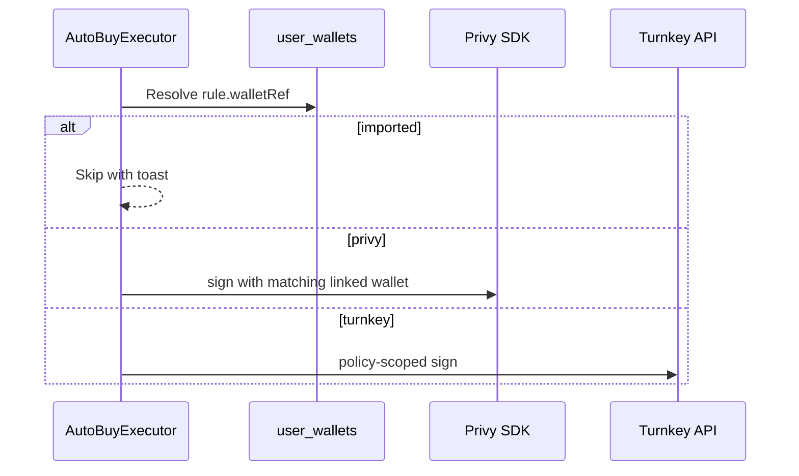

# Multi-wallet architecture — research & recommendation

**Status:** Research only (May 2026) — **pending product review**  
**Implementation:** Blocked until this doc and [`launchpad-deploy-apis.md`](./launchpad-deploy-apis.md) are approved.  
**Audience:** Product + engineering  
**Goal:** Let each user hold **N wallets** tagged as **dev**, **trading**, and **side**, with correct signing in manual trades and in **auto-buy / auto-sell / auto-launch** rules.

**Auto-launch dependency:** Programmatic deploy (see launchpad doc) requires knowing *which wallet* signs the create tx. Today Pointer uses a single implicit active wallet; categorized multi-wallet (or Turnkey for unattended deploy) must be decided here first.

---

## Executive summary

| Question | Finding |
|----------|---------|
| **(a) Can Privy hold multiple embedded wallets per user?** | **Yes.** Privy supports additional embedded wallets (HD / `createAdditional: true`) per user on Solana and EVM. Today Pointer creates **one** Sol embedded wallet on login. |
| **(b) Minimal architecture if not “Privy-only”?** | **Privy-first extension** is the smallest delta: multiple Privy embedded wallets + `user_wallets` metadata. **Turnkey** is the right long-term choice for **unattended automation** (auto-buy while user is offline), similar to Uxento-style WaaS. **Local keygen + `is_imported`** already exists but cannot power server-side automation. |
| **(c) UI changes?** | Unify wallet management in Settings; fix **primary vs active** drift; add **role/category** on each wallet; trade surfaces need explicit **execution wallet**; automation rules need a real **wallet picker** (not a disabled “Primary” stub). |
| **(d) Automation wallet selection?** | Persist `wallet_id` or `wallet_address` on each rule; executor resolves signing capability per row (`privy_embedded` vs `imported` vs `turnkey`). |

**Recommendation:** **Phased hybrid — Privy multi-wallet for v1 categories + UI**, then **Turnkey (or Privy server wallets + policies)** for automation signing if unattended execution is required.

---

## 1. Current state (Pointer codebase)

### 1.1 Identity & signing

```mermaid
flowchart LR
  subgraph login [Login paths]
    P[Privy email/social]
    T[TonConnect proof]
  end
  subgraph db [(Postgres)]
    U[users]
    UW[user_wallets]
  end
  subgraph sign [Trade sign]
    PS[Privy signAndSendTransaction]
    TC[TonConnect sendTransaction]
  end
  P --> U
  P --> UW
  T --> U
  T --> UW
  UW --> PS
  UW --> TC
```

| Path | Auth | Signing | DB rows |
|------|------|---------|---------|
| **Privy** | Bearer access token | `@privy-io/react-auth/solana` `useSignAndSendTransaction` | `sync-privy` inserts “Privy Solana” (and EVM) |
| **TonConnect** | Pointer session JWT (`w` = TON address) | `tonConnectUI.sendTransaction` | Legacy TON row + manual create |

**Privy client config** (`lib/privy/publicConfig.ts`):

- `embeddedWallets.solana.createOnLogin: 'users-without-wallets'` → **at most one auto-created Sol wallet per login** today.
- `walletChainType: 'ethereum-and-solana'`.

**Relevant files:**

| Area | Path |
|------|------|
| Privy config | `lib/privy/publicConfig.ts`, `lib/privy/config.ts` |
| Auth sync | `lib/hooks/useAuthSync.ts`, `app/api/auth/sync/route.ts` |
| Privy → DB | `app/api/wallets/sync-privy/route.ts` |
| Active wallet | `lib/hooks/useActiveSolanaWallet.ts`, `store/activeWallet.ts` |
| Trade execution | `lib/hooks/usePulseQuickBuy.ts`, `lib/hooks/usePointerTradeSubmit.ts` |
| Wallet CRUD API | `lib/db/userWallets.ts`, `app/api/wallets/create/route.ts`, `app/api/wallets/[id]/route.ts` |

### 1.2 `user_wallets` schema (already multi-row)

From `lib/supabase/types.ts` (migrations under `scripts/`):

| Column | Purpose today |
|--------|----------------|
| `wallet_address` | Canonical address (TON / Sol / EVM) |
| `label` | Free text |
| `is_primary` | One “default” row per user (server portfolio default) |
| `slot` | Numeric ordering (not role semantics) |
| `is_active` / `is_archived` | Visibility |
| `is_imported` | Client-generated or watch-only; **trading blocked** in `usePulseQuickBuy` |

**There is no `category` / `role` column** (`dev` | `trading` | `side`) today.

### 1.3 Three different “primary” concepts (bug surface)

| Concept | Where | Used by |
|---------|-------|---------|
| **DB `is_primary`** | `user_wallets` | `resolveDefaultWalletAddress`, portfolio API default |
| **Client active wallet** | Zustand `activeWalletAddress` | Pulse quick buy/sell, Buy/Sell panel |
| **UI label “Primary wallet”** | `AutoSellSettings` | Declarative only — **not wired** |

`WalletsManage.tsx` can set **active** client-side but **does not call** `PATCH { is_primary: true }` (component exists but is **not mounted** in app shell; portfolio tab is the live UI).

**Auto-buy / auto-sell today:** both call `usePulseQuickBuy` → **`useActiveSolanaWallet`**, i.e. whatever wallet the user last selected in the chrome — not necessarily DB primary, and not what the auto-sell UI claims.

### 1.4 Automation wallet scope

| Feature | Declared scope | Runtime |
|---------|----------------|---------|
| Auto-sell | `AutoSellWalletScope = 'primary'` (`lib/autoSell/types.ts`) | **Ignored** — uses active wallet from hook |
| Auto-buy | No wallet field | Active wallet from hook |

Types already reserve `walletScope: 'primary'`; executor does not read it.

---

## 2. (a) Privy: multiple embedded wallets per user?

### 2.1 Product capability

Privy documents **programmatic wallet creation** and **additional embedded wallets**:

- React: `useCreateWallet` from `@privy-io/react-auth` / `@privy-io/react-auth/solana`.
- Parameter **`createAdditional: true`** is required if the user already has an embedded wallet on that chain ([Create a wallet](https://docs.privy.io/wallets/wallets/create/create-a-wallet)).
- **HD wallets** recipe supports many addresses from one user seed ([HD wallets](https://docs.privy.io/recipes/hd-wallets)).
- **Policies / signers** can scope what each key may do ([controls](https://docs.privy.io/controls/overview)).

Public examples (Privy blog): apps give users **multiple embedded wallets** for different purposes (e.g. membership vs spending wallet).

### 2.2 Fit for dev / trading / side

| Approach | How | Pros | Cons |
|----------|-----|------|------|
| **A. Multiple Privy embedded wallets** | `createWallet({ createAdditional: true })` × N; store each address in `user_wallets` with `category` | Real signing in-app; no new vendor for manual trade | User must be logged in for signing; automation while offline is hard |
| **B. One Privy wallet + HD-derived addresses** | Single seed; derive paths; only one “active” signer unless Privy exposes all | Cheaper UX for deposit addresses | Signing model per address must be verified against Privy SDK |
| **C. Privy server-owned wallets** | Backend creates wallets owned by authorization key | Enables server-initiated flows | Strong custody/compliance story needed; not current Pointer model |

### 2.3 Pointer gap

- `lib/auth/solanaShims.ts` **stubs** `useCreateWallet` for TON import flows — **not** the real Privy hook.
- `lib/wallets/embeddedCreate.ts` generates keys **in the browser** and stores `is_imported: true` — **Privy cannot sign** those Sol rows.
- `sync-privy` only upserts wallets returned from the user’s current Privy session (typically **one** Sol + one EVM).

**Conclusion (a):** Privy **can** hold N embedded wallets per user. Pointer does **not** use that yet. Extending Privy is the **lowest-friction** path for categorized **manual** trading wallets.

---

## 3. (b) Alternatives — minimal architectures

### 3.1 Option 1 — Privy multi-wallet only (minimal)

**Architecture**

1. Add `wallet_category` enum on `user_wallets`: `dev` | `trading` | `side` (unique per user optional).
2. On onboarding or “Add wallet”, call Privy `createWallet({ createAdditional: true })` for Sol.
3. `sync-privy` extended to upsert **all** linked embedded accounts, not only the first.
4. `usePointerTradeSubmit`: resolve Privy wallet by `wallet_address` from `useWallets()`.
5. Automation rules store `wallet_id`; executor uses same resolution.

**Tradeoffs**

| Pros | Cons |
|------|------|
| Smallest schema + SDK change | Auto-buy while user offline still needs live session or queued UX |
| Reuses existing Privy spend | TON path remains separate (TonConnect) |
| No new custody vendor | Policy limits (rate, allowlist) need Privy policies or app-side guards |

**Effort:** ~1–2 weeks (UI + sync + signing resolution + tests).

---

### 3.2 Option 2 — Turnkey embedded WaaS (Uxento-style)

**Architecture**

- One **Turnkey sub-organization per user** ([sub-organizations](https://docs.turnkey.com/concepts/sub-organizations)).
- Create **3 wallets** (or one wallet + HD paths) labeled dev / trading / side.
- **Delegated / 2-of-2** policies: user passkey + backend API key for automation ([embedded WaaS](https://docs.turnkey.com/embedded-wallets/embedded-waas)).
- `user_wallets` stores `turnkey_wallet_id`, `category`, address.
- Auto-buy executor calls Turnkey sign API with policy checks; manual UI can still use Privy or Turnkey passkey flow.

**Tradeoffs**

| Pros | Cons |
|------|------|
| Built for **unattended** signing | New vendor, billing, security review |
| Clear policy boundaries per wallet | Migration from Privy-only users |
| Matches competitor pattern (Uxento) | Dual sign paths (Privy + Turnkey) during transition |

**Effort:** ~6–10 weeks (integration, policies, migration, audit).

---

### 3.3 Option 3 — App keystore (envelope-encrypted seeds)

Store encrypted private keys server-side (KMS + per-user DEK); decrypt only in HSM/signing service.

| Pros | Cons |
|------|------|
| Full control | Highest security/compliance burden |
| Works without Privy | You become custodian; key rotation pain |

**Not recommended** unless regulatory strategy requires self-custody of keys. Turnkey/KMS products exist precisely to avoid building this.

---

### 3.4 Option 4 — User-imported keys only (`is_imported`)

Already partially implemented (`embeddedCreate.ts`, `ImportWalletModal.tsx`).

| Pros | Cons |
|------|------|
| Fast for power users | **Cannot** auto-sign on server |
| No vendor lock-in for keys | Users must custody secrets; support burden |

**Suitable for** watch-only / manual client sign, **not** for auto-buy/auto-sell.

---

### 3.5 Comparison matrix

| Criterion | Privy multi-wallet | Turnkey | App keystore | Imported keys |
|-----------|-------------------|---------|--------------|---------------|
| N categorized wallets | Yes | Yes | Yes | Yes |
| Manual in-app sign | Yes | Yes (with UX) | Yes | Client-only |
| Unattended auto-buy | Weak | **Strong** | Strong | No |
| Time to ship v1 | **Low** | High | High | Low (no automation) |
| Custody model | Privy TEE | Turnkey / quorum | You | User |
| Pointer fit today | **Best** | Strategic | Poor | Partial |

---

## 4. (c) UI changes — Settings & trade flows

### 4.1 Settings → Wallets (new section)

Mount wallet management in **Settings** (today: theme, display, auto-sell only — see `SettingsModal.tsx`).

| Control | Behavior |
|---------|----------|
| Wallet list | All non-archived rows with category badge (dev / trading / side) |
| Create wallet | Privy `createAdditional` + pick category |
| Set default | Updates **both** `is_primary` (API) **and** active wallet (Zustand) |
| Archive | Existing `is_archived` |
| Import watch-only | Keep `is_imported`; show “cannot automate” |

**Fix:** Wire `WalletsManage.tsx` or merge into portfolio with `PATCH /api/wallets/[id] { is_primary: true }`.

### 4.2 Global chrome (Topbar / BottomBar)

| Element | Change |
|---------|--------|
| Wallet switcher | Show **category + truncated address**; not address alone |
| Active vs primary | Tooltip if they differ: “Trading active; Primary for portfolio default” |

### 4.3 Trade surfaces

| Surface | Today | Target |
|---------|-------|--------|
| `BuySellPanel` | Multi-select UI; execution uses **one** active wallet | Explicit **“Execute from: [trading ▼]”** bound to rule or session |
| `WalletPickerPopover` | Shortlist for “instant trade”; comment says batch TBD | Either implement multi-wallet batch or hide until ready |
| Pulse quick buy | Active wallet | Same dropdown; persist per-session or per-preset |
| Portfolio | Filter by wallet | Filter by category |

### 4.4 Auto-buy / Auto-sell (Alert Builder + Settings)

| Surface | Change |
|---------|--------|
| Alert Builder auto-buy tab | **Wallet:** dropdown of **signable** wallets (exclude `is_imported`) |
| Auto-Sell Settings | Replace disabled select with same dropdown |
| Rule summary line | `@handle · buy 0.5 SOL · wallet: trading (7xK…)` |

---

## 5. (d) Wallet selection in automation rules

### 5.1 Data model

Extend automation / auto-sell prefs (and twitter rule `action_config` if needed):

```ts
type AutomationWalletRef =
  | { kind: 'primary' }           // resolve at runtime → is_primary row
  | { kind: 'category'; category: 'dev' | 'trading' | 'side' }
  | { kind: 'wallet'; walletId: string };  // stable FK
```

Prefer **`wallet_id` (UUID)** over address strings (addresses can be re-linked).

Add on `user_wallets`:

```sql
wallet_category text check (wallet_category in ('dev','trading','side')),
signing_provider text check (signing_provider in ('privy','tonconnect','imported','turnkey')),
privy_wallet_id text null,  -- if Privy exposes stable id
turnkey_wallet_id text null
```

### 5.2 Executor behavior



| Step | Logic |
|------|--------|
| Resolve wallet | `primary` → `is_primary`; `category` → unique active row; `walletId` → direct |
| Pre-flight | Balance, `userCanUseWalletForTrading`, chain = Sol for Solana automation |
| Sign | Provider-specific |
| Audit | Log `wallet_id`, tx signature on alert payload |

### 5.3 Failure modes (user-visible)

| Case | Toast / behavior |
|------|------------------|
| Wallet archived | Skip: “Wallet inactive” |
| Imported wallet on rule | Skip: “Connect a signable wallet” |
| Privy session missing | Skip: “Sign in to run auto-buy” |
| Category not created | Skip: “No trading wallet” |

---

## 6. Recommended path

### Phase 1 — Privy N wallets + categories (ship first)

**Scope**

1. DB: `wallet_category`, `signing_provider` (default `privy` / `tonconnect` / `imported`).
2. Privy: real `useCreateWallet({ createAdditional: true })` for Sol; extend `sync-privy`.
3. Settings + Portfolio: category labels; fix primary API sync.
4. Automation: `walletRef` on auto-buy store + auto-sell rules; executor resolves wallet before `buyToken` / `sellTokenPct`.
5. Unify **active** = user choice, **primary** = portfolio default (copy in UI).

**Outcome:** Users can organize dev / trading / side and bind rules to a wallet. Automation runs when **user has an active Privy session** (same as today, but explicit).

### Phase 2 — Unattended automation (if product requires)

If auto-buy must fire when the user is **offline**:

- Add **Turnkey** sub-org per user **or** Privy **server wallets** with strict policies (allowlist programs, max SOL per tx).
- Automation executor prefers Turnkey/Privy-server path; manual UI can remain Privy embedded.

**Decision gate:** Does Pointer require server-side signing without a browser session?

- **No** → stop after Phase 1.
- **Yes** → budget Turnkey; treat Privy as login + optional manual-only wallets.

---

## 7. Open questions for product

1. **Per chain:** Are dev/trading/side **Sol-only**, or does each category exist on TON too?
2. **Cardinality:** Exactly one wallet per category, or many wallets with one “default trading”?
3. **TON users:** Is TonConnect-only auth allowed to run Sol auto-buy, or is Privy mandatory for automation?
4. **Compliance:** Is backend signing (Turnkey) acceptable for retail users?
5. **Migration:** Do existing users get three auto-created wallets, or opt-in “Add trading wallet”?

---

## 8. References

| Resource | URL |
|----------|-----|
| Privy — Create a wallet | https://docs.privy.io/wallets/wallets/create/create-a-wallet |
| Privy — HD wallets | https://docs.privy.io/recipes/hd-wallets |
| Privy — Wallet controls | https://docs.privy.io/controls/overview |
| Turnkey — Embedded WaaS | https://docs.turnkey.com/embedded-wallets/embedded-waas |
| Turnkey — Sub-organizations | https://docs.turnkey.com/concepts/sub-organizations |
| Pointer `user_wallets` | `lib/db/userWallets.ts`, `lib/supabase/types.ts` |
| Pointer active wallet | `lib/hooks/useActiveSolanaWallet.ts` |

---

## 9. Decision record (recommended)

| Decision | Choice | Rationale |
|----------|--------|-----------|
| **N wallets per user** | Yes, in `user_wallets` | Schema already supports N rows |
| **Categories** | New `wallet_category` column | `label` is freeform; roles need structure |
| **Privy multi-wallet** | **Yes for v1** | Documented API; smallest lift |
| **Turnkey** | **Phase 2 if unattended** | Matches Uxento-class automation; avoid premature vendor |
| **Imported keys** | View-only + manual; block automation | Already enforced in `usePulseQuickBuy` |
| **Rule wallet binding** | `wallet_id` on each automation rule | Explicit, auditable, matches UI dropdown |

**Single sentence:** Extend Privy with `createAdditional` wallets and structured categories in Postgres for v1; add Turnkey (or Privy server wallets) only when product requires signing without an active browser session.
